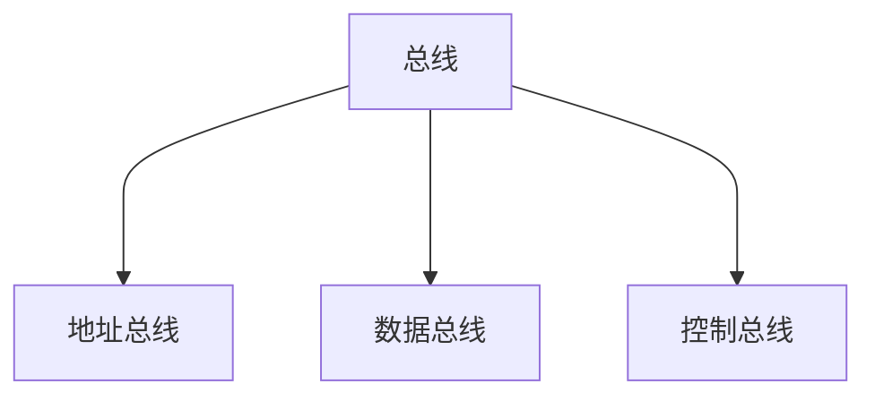
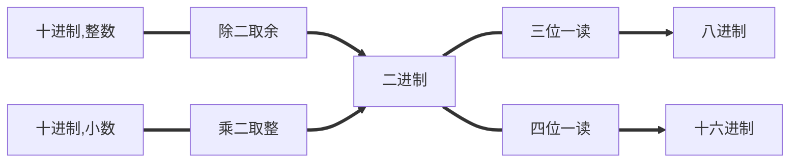
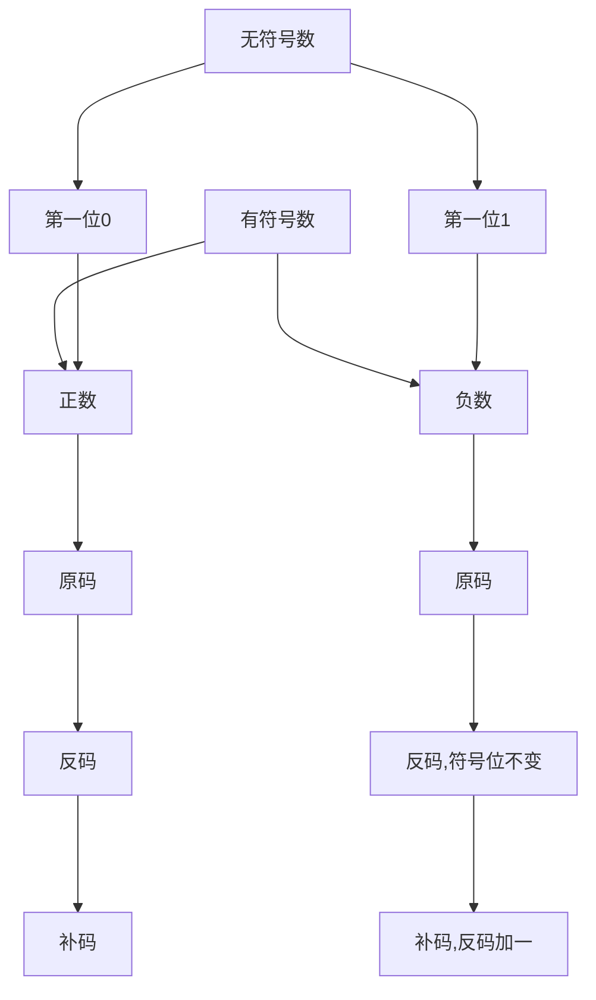

# 微型计算机基础知识
----
1.微处理器发展阶段

2.计算机中数的表达方式

3.计算机系统的组成，计算机的工作过程

* 重点：微机工作过程，计算机中有符号数的表示
* 难点：指令在计算机中执行过程
----
## 微处理器发展阶段
----
微型处理器发展进程：
生产年份|产品|主要性能及说明|
---|---|---|
1971|4004|第一片4位cpu[^cpu]采用了10μm制程|
1972|8008|第一片8位处理器|
1978|8086/8088|第一片16位处理器|
1985|80386|第一片32位处理器|


微机类型：


类型|性能|
---|---|
单片机|微处理器，存储器，输入输出集成在一块集成电路板上。最大优点体积小。但存储容量小，输入输出接口简单功能较低|
单板机|计算机各个部分组装在带你鲁班上，包括微处理器、存储器、输入输出接口，还有简单的二极管显示器，小键盘，插座等。功能比单片机强，适合进行生产过程的控制。|
个人计算机|供单个用户操作的计算机系统。|
多用户系统|一个主机连接多个终端，多个用户同时使用主机，共享计算机的硬件软件资源。|
微型计算机网络|多个微型计算机系统连接起来，通过通信线路实现各个计算机系统的信息交换，信息处理等。|
## 计算机系统的组成
----
### 硬件系统
冯诺依曼结构：
* ==运算器==
* 存储器
* ==控制器==
* 输入设备
* 输出设备

运算器 控制器在微处理器内部
现代计算机结构：

1.主机
  * cpu
  * 主板
  * 内存储器（内存条）
  * 总线
  * I/O接口

2.输入设备

3.输出设备



### 软件系统
操作系统的进化：最早的dos系统，1995年window95带入了图形化界面时代。

## 微处理器结构模型的组成
----
微处理器是一个非常复杂的查大规模集成电路芯片。微处理器由以下几部分组成：

* 运算器
* 控制器
* 内部寄存器

运算器：又称算术逻辑单元，用来进行算数或者逻辑运算，以及位移循环等操作。
控制器，包含三个部分：
* 指令寄存器：用来存放从存储器取出的==将要==执行的指令==实际为操作码，也就是二进制数字==
* 指令译码器：用来对指令寄存器中的指令进行译码
* 可编程逻辑阵列：用来产生取指令和执行指令所需的各种信号

内部寄存器：包含有若干个不同功能的寄存器或寄存器组，以下是最基本的寄存器的描述：
* 累加器：使用最频繁的寄存器。进行算数逻辑运算是，就有双重功能，=-=运算前用来保存一个操作数，运算后保存运算结果==
* 数据寄存器用来暂存数据或者指令，从中读出时，读出的是指令则经DR暂存的指令通过内部数据总线送到指令寄存器IR；读出的是数据则通过内部数据总线送到有关的寄存器或者运算器
* 程序计数器（PC）用来存放==正待取出的指令的地址==，根据PC中的指令，准备从存储器中取出将要执行的指令。==PC具有自动加一的功能==
* 地址寄存器（AR）用来存放正要取出指令的地址或操作数的地址地址来自PC
* 标志寄存器（FR）用来寄存执行指令时所产生的结果或状态有关的标志信号
  
## 存储器的组成与读写操作
----
### 存储器的组成
讨论的存储器通常是内存，每一个存储单元中一般存放一个字节的信息。存储到元的总数目称为存储容量。具体数目取决于地址线的根数。
来自cpu的地址输入地址译码器，然后寻找对应的存储单元。

### 存储器的读写操作过程
----
#### 存储器读的过程
1.cpu地址寄存器AR给出地址，然后放到地址总线上，经地址译码器译码选中04H单元

2.cpu发出读的信号给存储器，指示他准备把04H单元的内容放到数据总线上

3.存储器将04H单元的内容放到数据总线上，送至数据寄存器DR，然后cpu取走该数据进行使用。

4.==读取完成后04H的内容不变==

#### 存储器写的过程
1.cpu地址寄存器把08H放到地址总线上，经地址译码器选中08H单元

2.cpu把数据寄存器中的内容放到数据总线上

3.cpu向存储器发送写控制信号，数据寄存器的内容写入08H单元

## 微机工作过程
----
计算机的工作原理是==存储程序+程序控制==

有以下一段程序：
```x86asm
mov a,3
add a,2
hlt
```

其在内存中存储形式如下图：
.jpg)

## 微机的运算基础
----
### 进位计数制
* 十进制 D
* 二进制 B
* 八进制 Q
* 十六进制 H

### 进制转换



### 二进制编码
* BCD码--二进制中的十进制
* ascii码 
  
### 二进制的运算
* 加
* 减
* 乘 直接算/通过加法和移位计算
* 除

### 二进制的逻辑运算
* 与 and
* 或 or
* 非 not
* 异或 xor

## 数的定点与浮点表示
----
* 定点表示：N=2^P^×S S为N的尾数，P为N的阶码。P确定小数点的位置。
* 浮点表示：N的阶码可以去不同的值则称为数的浮点表示法。

## 带符号数的表示法
----
###　机器数的种类
* 原码
* 反码
* 补码



### 溢出及其判断方法

补码运算溢出,超出所能表示范围.

溢出判断方法:符号位相加的和,与数据最高位相加的和进行异或 ,若为1则溢出.

[^cpu]:中央处理器部件（Central Processing Unit, CPU）
