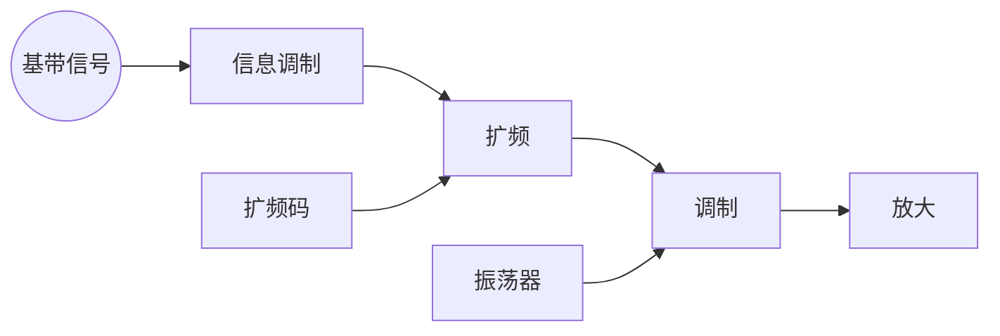

# 扩频通信
----
## 绪论
----
* 干扰:单频干扰,窄带干扰,正弦脉冲干扰,跟踪式干扰,转发式干扰,宽带阻塞式干扰.
* 抗干扰:改变频率,再次改变频率,跳频,快跳频,多网,引诱,ECCM
* 抗干扰技术:扩频技术,强方向性毫米波,加密技术,猝发通信技术,天线零相技术,分集技术.
* 扩频方式:直接序列扩频,跳频,跳时,线性调频.
## 扩频技术及其理论基础
----
* 香农公式,指导着信号带宽与信噪比的互换.
* 扩频系统的物理模型

* 直扩系统的特点:较强的干扰能力,具有很强的隐蔽性和抗侦察的能力,具有选址能力,抗多径干扰,可进行高分辨率的测向,定位.
* 跳频:可选频带越多则抗干扰能力越强
* 跳频特点:较强抗干扰能能力,易于组网,易兼容.
* 跳时:为随机信号控制发送时刻.
* 混合扩频
## 扩频系统的伪随机序列
----
* 伪随机码的概念:在码字相当长的情况下可以做到几乎无差错的从遭受白噪音干扰的信号中恢复出原信息.
* 位移寄存器序列,通过画出的图形进行计算
* m序列产生方法:反馈位移寄存器,循环序列发生器
* m序列发生器结构:简单型:ssrg,模件抽头型:msrg.
* m序列性质:
  * 均衡性:0和1个数基本相等.
  * 游程分布:1占1/2,2占1/4....
  * 位移相加性:位移后摩尔加还是位移后的结果
  * 周期性:$N=2^r-1$,r为反馈位移寄存器的级数
  * 伪随机性:10概率相等,
* gold码式m序列的组合码.
* 扩频进行相干接受,直接与本地的伪码进行相干计算
## 扩频系统的同步
----
* 同步不确定性的来源:频率源的漂移.电波传播的时延.多普勒频移.多径效应.
* 直扩系统的同步
  * 伪随机码同步,初始同步,跟踪.
  * 位同步
  * 帧同步
  * 载波同步
## 扩频多址技术
----
* 蜂窝技术
  * 小区与区群的概念
* 多址技术
  * 时分
  * 频分
  * 码分---wash函数
  * 跳频